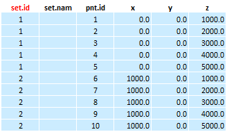
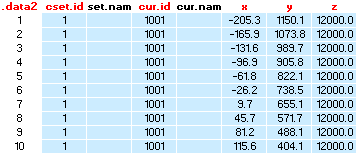

# Femap/Geometry

### *femap_xls_draw_points*
|femap_xls_draw_points   ()|
|:----------------------------------------|
|Description:|
|Method draws points from defined SET.ID's in a currently open FEMAP session. User is prompted with InputBox and asked to define set.id's he wants to have drawn in FEMAP. Appriopriate Excel data table is required for proper execution (See Remarks/Usage).|
|Input:|
|None|
|Output:|
|None|
|Return Code:|
|None|
|Remarks/Usage:|
|Method is primarily looking for **`set.id`** keyword, from which it will build 2D data array.   **`set.nam`** is obsolete for Femap and serves only to indicate the user what the points are referring to. **`pnt.id`** parameter defines unique ID that points will have assigned in Femap. If left empty, first available ID will be assigned to the points.  **`x, y, z`** stand for coordinates, provided in units defined in Femap session.      Method calls in **`femap_create_points, xls_inputbox, a_base0, a_make, a_tidy`**, and **`a_look`** functions.|
|Example:|
|None|

### *femap_create_points*
|femap_create_points   (x, y, z, pointID)|
|:----------------------------------------|
|Description:|
|Method creates points in currently active Femap session.|
|Input:|
|**DOUBLE `x, y, z`** &nbsp; Coordinates of the point to be created in Femap. Units should match as defined in Femap.|
|**LONG `[pointID]`** &ensp; Unique ID number of the points to be created. If omitted, or 0, femap will assign first available ID number to the point.|
|Output:|
|None|
|Return Code:|
|None|
|Remarks/Usage:|
|Function requires active Femap session.  Point ID's if defined has to be unique.|
|Example:|
|None|

### *femap_xls_draw_curves*
|femap_xls_draw_curves   ()|
|:----------------------------------------|
|Description:|
|Method aggregates data from the spreadsheet and creates curves in currently active Femap session. Appriopriate Excel data table is required for proper execution (See Remarks/Usage).  User is prompted with a dialog box to choose whether he wants to draw single/multiple set **`cset.id`** or curve **`cur.id`**.|
|Input:|
|Input values are read from the data table in spreadsheet.|
|Output:|
|None|
|Return Code:|
|None|
|Remarks/Usage:|
|Method is primarily looking for **`cset.id`** or **`cur.id`** keyword, from which it will build 2D data array.   **`set.nam`** & **`cur.nam`** are obsolete for Femap and serve only to indicate the user what the curves are referring to. **`cur.id`** parameter defines unique ID that curves will have assigned in Femap. If left empty, first available ID will be assigned to the curves.  **`x, y, z`** stand for coordinates of points that curve will be stretched between, provided in units defined in Femap session.  Design of the input table is critical for proper functioning of the method.     Method calls in **`femap_oGeo_draw_line, get_curve_id_dialog, a_base0, a_make, a_tidy, sRange_to_array, a_contains`**, and **`a_look`** functions.|
|Example:|
|None|

### *femap_xls_draw_surfs*
|femap_xls_draw_surfs   ()|
|:----------------------------------------|
|Description:|
|Method aggregates data from the spreadsheet and creates curves in currently active Femap session. Appriopriate Excel data table is required for proper execution (See Remarks/Usage).  User is prompted with a dialog box to choose whether he wants to draw single/multiple set **`cset.id`** or curve **`cur.id`**.|
|Input:|
|Input values are read from the data table in spreadsheet.|
|Output:|
|None|
|Return Code:|
|None|
|Remarks/Usage:|
|Method is primarily looking for **`cset.id`** or **`cur.id`** keyword, from which it will build 2D data array.   **`set.nam`** & **`cur.nam`** are obsolete for Femap and serve only to indicate the user what the curves are referring to. **`cur.id`** parameter defines unique ID that curves will have assigned in Femap. If left empty, first available ID will be assigned to the curves.  **`x, y, z`** stand for coordinates of points that curve will be stretched between, provided in units defined in Femap session.  Design of the input table is critical for proper functioning of the method.     Method calls in **`femap_oGeo_draw_line, get_curve_id_dialog, a_base0, a_make, a_tidy, sRange_to_array, a_contains`**, and **`a_look`** functions.|
|Example:|
|None|
